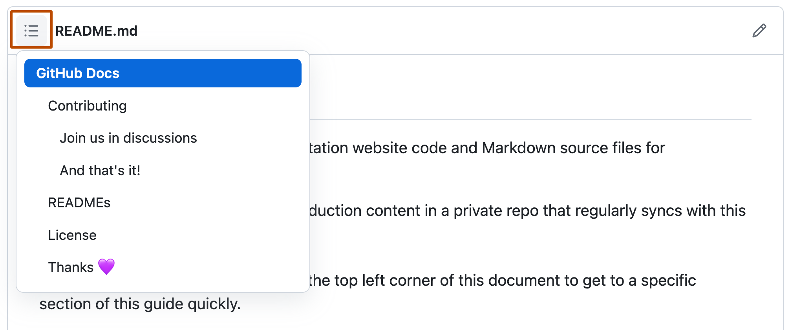

#  **Basic writing and formatting syntax**

> Create sophisticated formatting for your prose and code on GitHub with simple syntax.

 ## Headings 🔗

To create a heading, add one to six <kbd>**#**</kbd> symbols before your heading text. The number of <kbd>**#**</kbd> you use will determine the heararchy level and typeface size of the heading.

    # A first-level heading 
    ## A second-level heading
    ### A third-level heading

# A first-level heading
## A second-level heading
### A third-level heading

When you use two ir more headings in GitHub automatically generates a table of contects that you can access by clicking  within the file header. Each heading title is listed in the table of contents and you can click a tilte to navigate to selection section. 

## Styling text 
You can indicate emphasis with bold, italic, strikethough, subscript text in comment fields and <kbd>**.md**</kbd> files.

